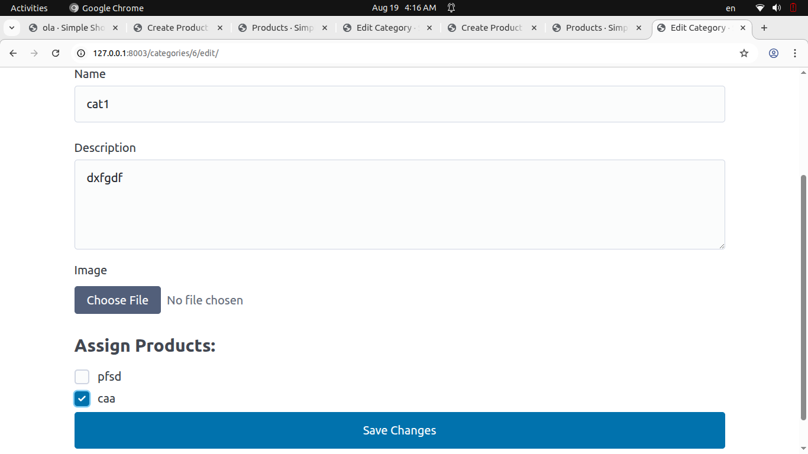
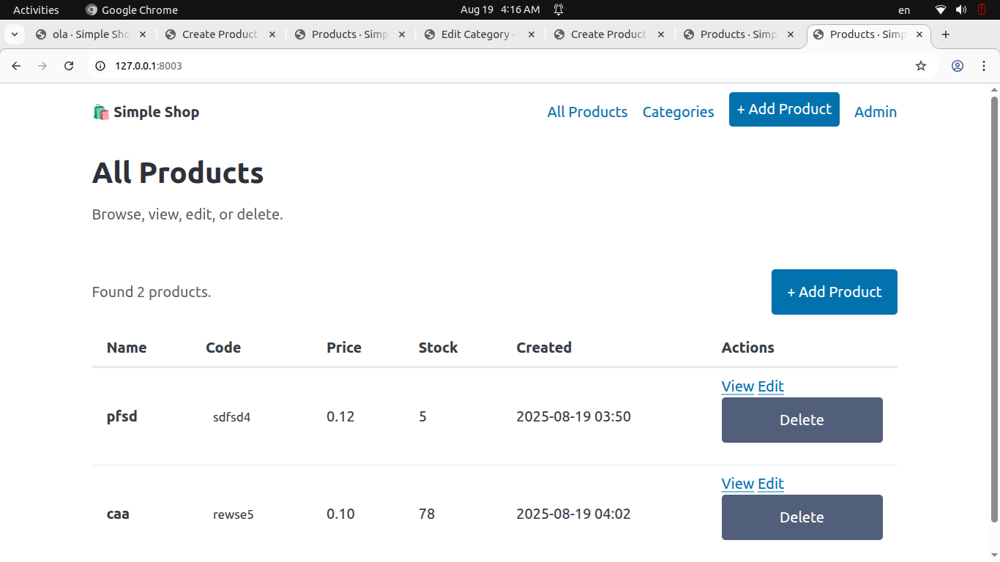
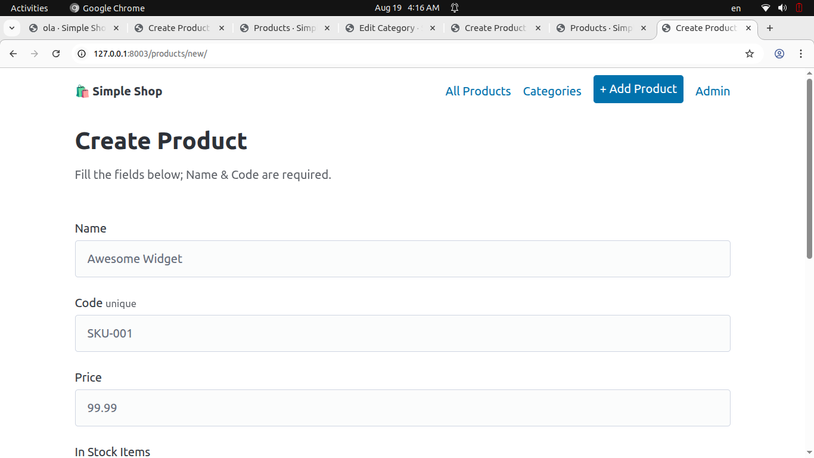
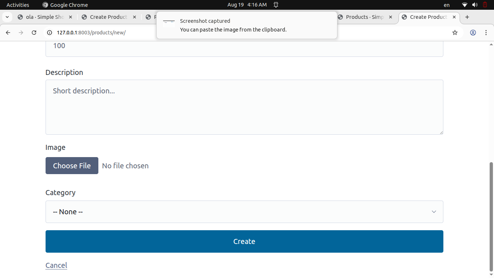
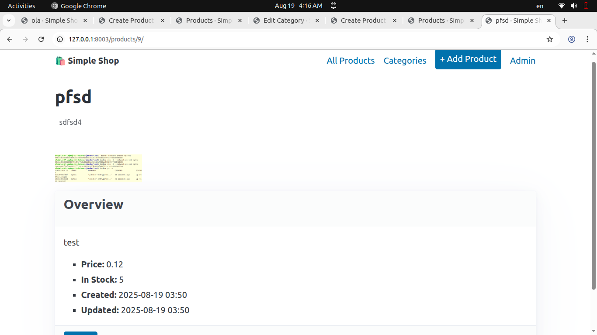
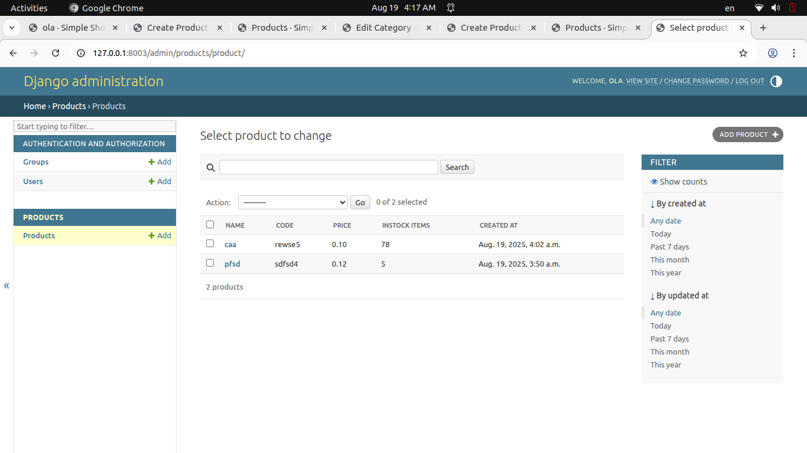
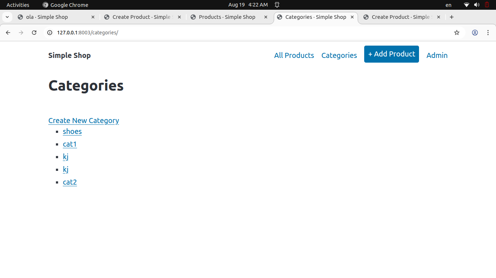
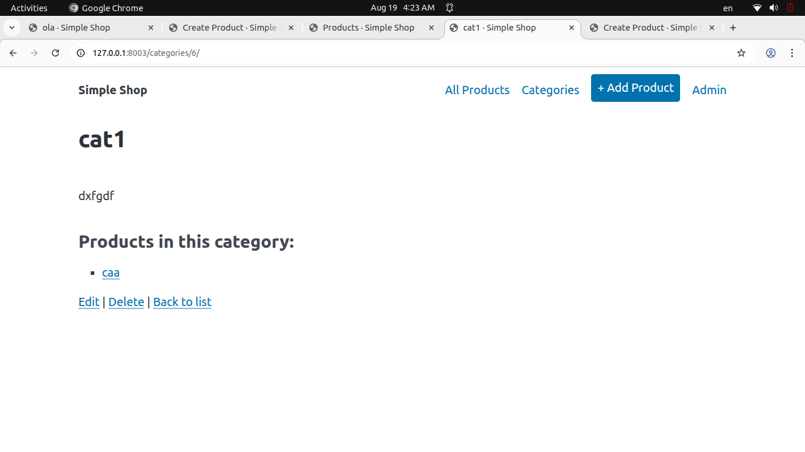

---

# Simple Shop

A lightweight Django e-commerce application for managing **products** and **categories**. Users can create, edit, and delete products and categories, assign products to categories, and view product details.

---

## Features

* **Products Management**

  * Create, edit, and delete products
  * Assign products to categories
  * Upload product images
  * Track stock items and prices

* **Categories Management**

  * Create, edit, and delete categories
  * Assign multiple products to a category
  * Upload category images

* **Relationships**

  * Many-to-many relationship between products and categories
  * Easy navigation between products and categories

* **Frontend**

  * Clean HTML templates
  * Forms for create/update actions
  * List and detail pages for products and categories

---

## Installation

1. **Clone the repository**

```bash
git clone <your-repo-url>
cd simple_shop_project
```

2. **Create a virtual environment**

```bash
python3 -m venv .venv
source .venv/bin/activate  # Linux/Mac
.venv\Scripts\activate     # Windows
```

3. **Install dependencies**

```bash
pip install -r requirements.txt
```

4. **Run migrations**

```bash
python manage.py makemigrations
python manage.py migrate
```

5. **Create a superuser (optional)**

```bash
python manage.py createsuperuser
```

6. **Run the development server**

```bash
python manage.py runserver
```

---

## Usage

### Products

| URL                    | Description          | Screenshot                                        |
| ---------------------- | -------------------- | ------------------------------------------------- |
| `/products/`           | List all products    |     |
| `/products/create/`    | Create a new product |  |
| `/products/<id>/`      | View product details |  |
| `/products/<id>/edit/` | Edit product         |      |

### Categories

| URL                      | Description                           | Screenshot                                          |
| ------------------------ | ------------------------------------- | --------------------------------------------------- |
| `/categories/`           | List all categories                   |    |
| `/categories/create/`    | Create a new category                 |  |
| `/categories/<id>/`      | View category details                 |  |
| `/categories/<id>/edit/` | Edit category, assign/remove products |      |

---

## Project Structure

```
simple_shop_project/
├── categories/
│   ├── models.py
│   ├── views.py
│   ├── forms.py
│   └── templates/categories/
├── products/
│   ├── models.py
│   ├── views.py
│   └── templates/products/
├── simple_shop/
│   ├── settings.py
│   └── urls.py
└── manage.py
```

---
## ScreenShots










---

